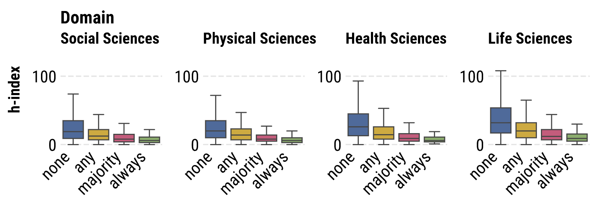
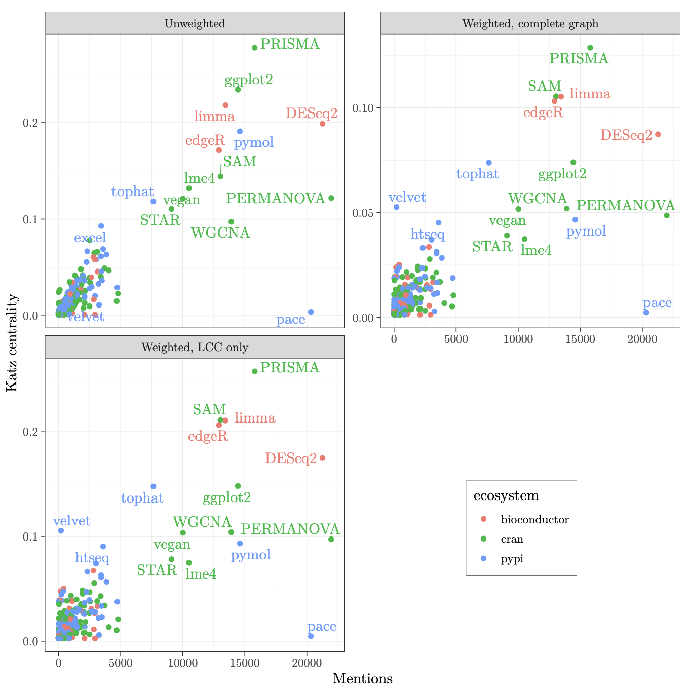
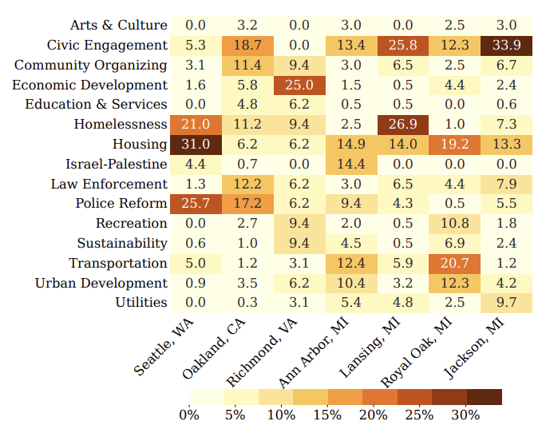

Please see my [Google Scholar Profile](https://scholar.google.com/citations?hl=en&user=Jhz4D7YAAAAJ&view_op=list_works&sortby=pubdate) or my [Semantic Scholar Profile](https://www.semanticscholar.org/author/Eva-Maxfield-Brown/2162029994) for a complete list of my publications.

##### Subject Matter

1. [Science of Scientific Software](#science-of-scientific-software)
1. [Public Interest Technology](#public-interest-technology)

#### Science of Scientific Software

##### Code Contribution and Credit in Science

Eva Maxfield Brown, Isaac Slaughter, Nicholas Weber
_In Review at the Journal of Quantative Science Studies - pre-print published: 17 October 2025_
[https://doi.org/10.48550/arXiv.2510.16242](https://doi.org/10.48550/arXiv.2510.16242)

_Software development has become essential to scientific research, but its relationship to traditional metrics of scholarly credit remains poorly understood. We develop a dataset of approximately 140,000 paired research articles and code repositories, as well as a predictive model that matches research article authors with software repository developer accounts. We use this data to investigate how software development activities influence credit allocation in collaborative scientific settings. Our findings reveal significant patterns distinguishing software contributions from traditional authorship credit. We find that nearly 30% of articles include non-author code contributors—individuals who participated in software development but received no formal authorship recognition. While code-contributing authors show a modest ∼4.2% increase in article citations, this effect becomes non-significant when controlling for domain, article type, and open access status. First authors are significantly more likely to be code contributors than other author positions. Notably, we identify a negative relationship between coding frequency and scholarly impact metrics. Authors who contribute code more frequently exhibit progressively lower h-indices than non-coding colleagues, even when controlling for publication count, author position, domain, and article type. These results suggest a disconnect between software contributions and credit, highlighting important implications for institutional reward structures and science policy._

##### Biomedical Open Source Software: Crucial Packages and Hidden Heroes

Eva Maxfield Brown, Stephan Druskat, Laurent Hébert-Dufresne, James Howison, Daniel Mietchen, Andrew Nesbitt, João Felipe Pimentel, Boris Veytsman
_In Review at PLOS Computational Biology - pre-print updated: 19 May 2025_
[https://doi.org/10.48550/arXiv.2404.06672](https://doi.org/10.48550/arXiv.2404.06672)

Despite the importance of scientific software for research, it is often not formally recognized and rewarded. This is especially true for foundational libraries, which are hidden below packages visible to the users (and thus doubly hidden, since even the packages directly used in research are frequently not visible in the paper). Research stakeholders like funders, infrastructure providers, and other organizations need to understand the complex network of computer programs that contemporary research relies upon. In this work, we use the CZ Software Mentions Dataset to map the upstream dependencies of software used in biomedical papers and find the packages critical to scientific software ecosystems. We propose centrality metrics for the network of software dependencies, analyze three ecosystems (PyPi, CRAN, Bioconductor), and determine the packages with the highest centrality.

##### Soft-Search: Two Datasets to Study the Identification and Production of Research Software

Eva Maxfield Brown, Lindsey Schwartz, Richard Lewei Huang, Nicholas Weber
_Accepted by JCDL 2023 - pre-print published: 27 February 2023_
[https://doi.org/10.1109/JCDL57899.2023.00040](https://doi.org/10.1109/JCDL57899.2023.00040)

_Software is an important tool for scholarly work, but software produced for research is in many cases not easily identifiable or discoverable. A potential first step in linking research and software is software identification. In this paper we present two datasets to study the identification and production of research software. The first dataset contains almost 1000 human labeled annotations of software production from National Science Foundation (NSF) awarded research projects. We use this dataset to train models that predict software production. Our second dataset is created by applying the trained predictive models across the abstracts and project outcomes reports for all NSF funded projects between the years of 2010 and 2023. The result is an inferred dataset of software production for over 150,000 NSF awards. We release the Soft-Search dataset to aid in identifying and understanding research software production: https://github.com/si2-urssi/eager_

#### Public Interest Technology

##### PUBLICSPEAK: Hearing the Public with a Probabilistic Framework

Tianliang Xu, Eva Maxfield Brown, Dustin Dwyer, Sabina Tomkins
_Accepted by AAAI - AI for Social Impact 2025_
[https://doi.org/10.1609/aaai.v39i27.35075](https://doi.org/10.1609/aaai.v39i27.35075)

_Local governments around the world are making consequential decisions on behalf of their constituents, and these constituents are responding with requests, advice, and assessments of their officials at public meetings. So many small meetings cannot be covered by traditional newsrooms at scale. We propose PublicSpeak, a probabilistic framework which can utilize meeting structure, domain knowledge, and linguistic information to discover public remarks in local government meetings. We then use our approach to inspect the issues raised by constituents in 7 cities across the United States. We evaluate our approach on a novel dataset of local government meetings and find that PublicSpeak improves over state-of-the-art by 10% on average, and by up to 40%._

##### Councils in Action: Automating the Curation of Municipal Governance Data for Research

Eva Maxfield Brown and Nicholas Weber
_ASIS&T 2022 - published: 19 April 2022_
[https://doi.org/10.1002/pra2.601](https://doi.org/10.1002/pra2.601)

_Large scale comparative research into municipal governance is often prohibitively difficult due to a lack of high-quality data. But, recent advances in speech-to-text algorithms and natural language processing has made it possible to more easily collect and analyze data about municipal governments. In this paper, we introduce an open-source platform, the Council Data Project (CDP), to curate novel datasets for research into municipal governance. The contribution of this work is two-fold: 1. We demonstrate that CDP, as an infrastructure, can be used to assemble reliable comparative data on municipal governance; 2. We provide exploratory analysis of three municipalities to show how CDP data can be used to gain insight into how municipal governments perform over time. We conclude by describing future directions for research on and with CDP such as the development of machine learning models for speaker annotation, outline generation, and named entity recognition for improved linked data._