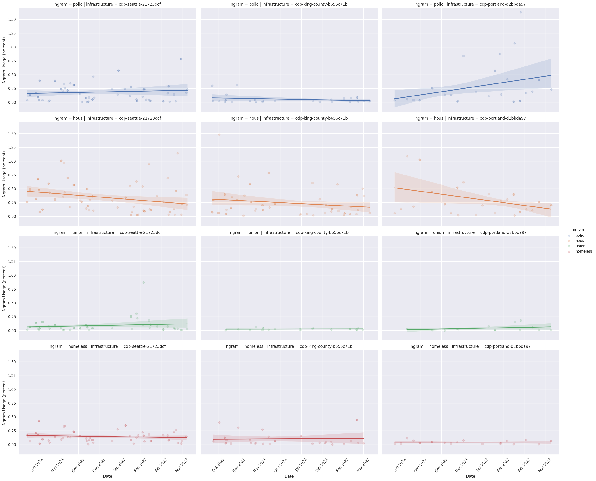
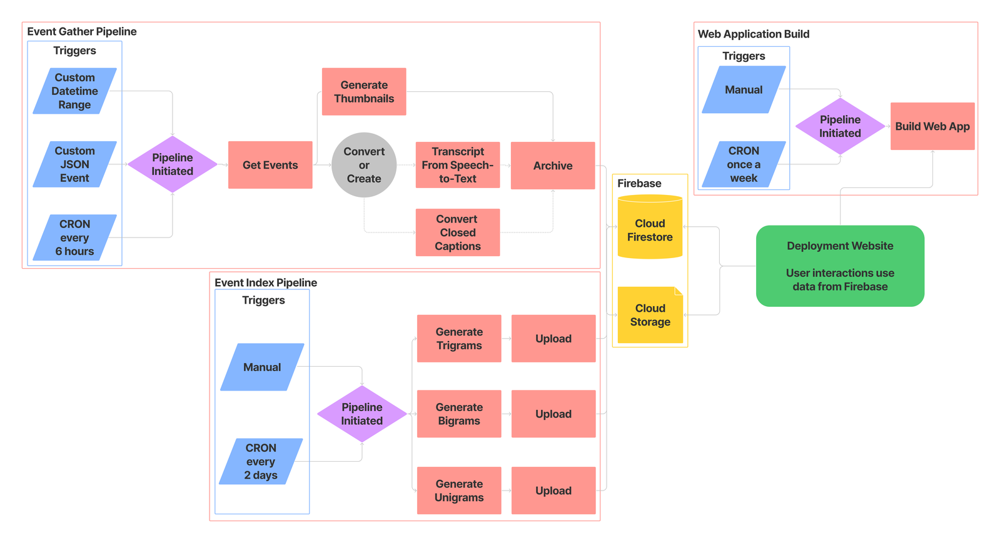
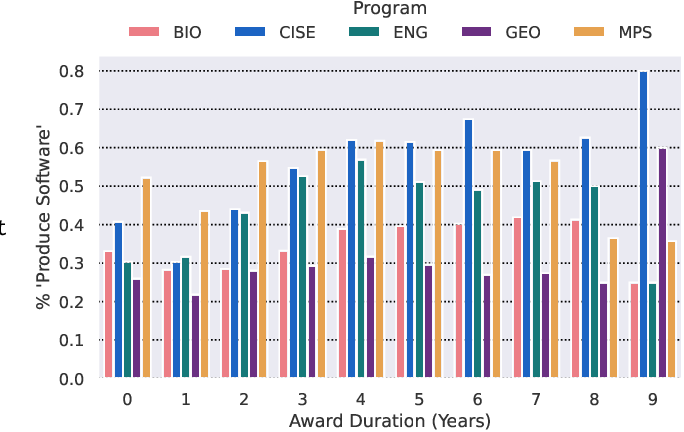
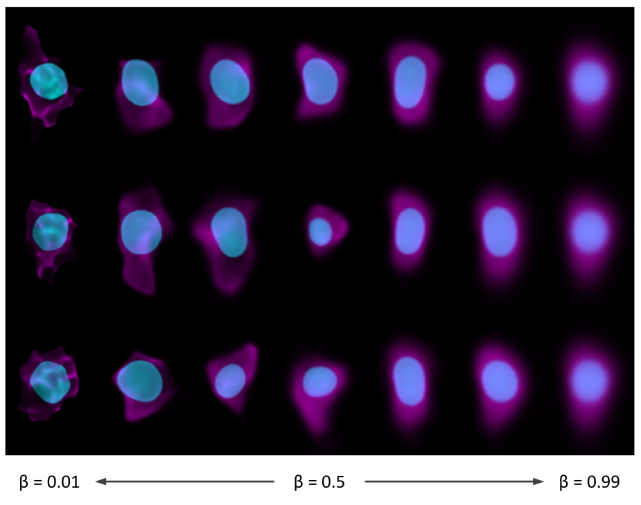

Please see my [Semantic Scholar Profile](https://www.semanticscholar.org/author/Eva-Maxfield-Brown/2162029994) for a complete list of my publications.

##### Subject Matter

1. [Public Interest Technology](#public-interest-technology)
1. [Research Software Engineering and Applied Machine Learning](#research-software-engineering-and-applied-machine-learning)
1. [Computational Biology](#computational-biology)

#### Public Interest Technology

##### Councils in Action: Automating the Curation of Municipal Governance Data for Research

Eva Maxfield Brown and Nicholas Weber
_ASIS&T 2022 - published: 19 April 2022_
[https://doi.org/10.1002/pra2.601](https://doi.org/10.1002/pra2.601)

_Large scale comparative research into municipal governance is often prohibitively difficult due to a lack of high-quality data. But, recent advances in speech-to-text algorithms and natural language processing has made it possible to more easily collect and analyze data about municipal governments. In this paper, we introduce an open-source platform, the Council Data Project (CDP), to curate novel datasets for research into municipal governance. The contribution of this work is two-fold: 1. We demonstrate that CDP, as an infrastructure, can be used to assemble reliable comparative data on municipal governance; 2. We provide exploratory analysis of three municipalities to show how CDP data can be used to gain insight into how municipal governments perform over time. We conclude by describing future directions for research on and with CDP such as the development of machine learning models for speaker annotation, outline generation, and named entity recognition for improved linked data._

##### Council Data Project: Software for Municipal Data Collection, Analysis, and Publication

Eva Maxfield Brown, To Huynh, Isaac Na, Brian Ledbetter, Hawk Ticehurst, Sarah Liu, Emily Gilles, Katlyn M. F. Greene, Sung Cho, Shak Ragoler, Nicholas Weber
_Journal of Open Source Software - published: 2 December 2021_
[https://doi.org/10.21105/joss.03904](https://doi.org/10.21105/joss.03904)

_Cities, counties, and states throughout the USA are bound by law to archive recordings of public meetings. Most local governments comply with these laws by posting documents, audio, or video recordings online. As there is no set standard for municipal data archives however, parsing and processing such data is typically time consuming and highly dependent on each municipality. Council Data Project (CDP) is a set of open-source tools that improve the accessibility of local government data by systematically collecting, transforming, and re-publishing this data to the web. The data re-published by CDP is packaged and presented within a searchable web application that vastly simplifies the process of finding specific information within the archived data. We envision this project being used by a variety of groups including civic technologists hoping to promote government transparency, researchers focused on public policy, natural language processing, machine learning, or information retrieval and discovery, and many others._

#### Research Software Engineering and Applied Machine Learning

##### Soft-Search: Two Datasets to Study the Identification and Production of Research Software

Eva Maxfield Brown, Lindsey Schwartz, Richard Lewei Huang, Nicholas Weber
_In review for JCDL 2023 - pre-print published: 27 February 2023_
[https://doi.org/10.48550/arXiv.2302.14177](https://doi.org/10.48550/arXiv.2302.14177)

_Software is an important tool for scholarly work, but software produced for research is in many cases not easily identifiable or discoverable. A potential first step in linking research and software is software identification. In this paper we present two datasets to study the identification and production of research software. The first dataset contains almost 1000 human labeled annotations of software production from National Science Foundation (NSF) awarded research projects. We use this dataset to train models that predict software production. Our second dataset is created by applying the trained predictive models across the abstracts and project outcomes reports for all NSF funded projects between the years of 2010 and 2023. The result is an inferred dataset of software production for over 150,000 NSF awards. We release the Soft-Search dataset to aid in identifying and understanding research software production: https://github.com/si2-urssi/eager_

#### Computational Biology

##### A deep generative model of 3D single-cell organization

Rory M. Donovan-Maiye, Eva M. Brown, Caleb K. Chan, Liya Ding, Calysta Yan, Nathalie Gaudreault, Julie A. Theriot, Mary M. Maleckar, Theo A. Knijnenburg, Gregory R. Johnson

_PLOS Computational Biology -- published: 18 January 2022_
[https://doi.org/10.1371/journal.pcbi.1009155](https://doi.org/10.1371/journal.pcbi.1009155)

_We introduce a framework for end-to-end integrative modeling of 3D single-cell multi-channel fluorescent image data of diverse subcellular structures. We employ stacked conditional β-variational autoencoders to first learn a latent representation of cell morphology, and then learn a latent representation of subcellular structure localization which is conditioned on the learned cell morphology. Our model is flexible and can be trained on images of arbitrary subcellular structures and at varying degrees of sparsity and reconstruction fidelity. We train our full model on 3D cell image data and explore design trade-offs in the 2D setting. Once trained, our model can be used to predict plausible locations of structures in cells where these structures were not imaged. The trained model can also be used to quantify the variation in the location of subcellular structures by generating plausible instantiations of each structure in arbitrary cell geometries. We apply our trained model to a small drug perturbation screen to demonstrate its applicability to new data. We show how the latent representations of drugged cells differ from unperturbed cells as expected by on-target effects of the drugs._
