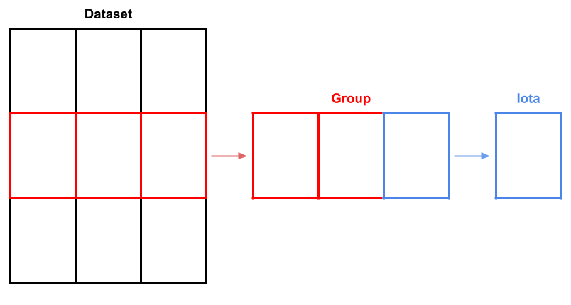

##### Subject Matter

1. [Public Interest Technology](#public-interest-technology)
1. [Data Archival](#data-archival)
1. [Computational Biology](#computational-biology)

#### Public Interest Technology

##### Councils in Action: Automating the Curation of Municipal Governance Data for Research

Eva Maxfield Brown and Nicholas Weber
_in review for ASIS&T 2022 - preprint published: 21 April 2022_
[https://doi.org/10.48550/arXiv.2204.09110](https://doi.org/10.48550/arXiv.2204.09110)

_Large scale comparative research into municipal governance is often prohibitively difficult due to a lack of high-quality data. But, recent advances in speech-to-text algorithms and natural language processing has made it possible to more easily collect and analyze data about municipal governments. In this paper, we introduce an open-source platform, the Council Data Project (CDP), to curate novel datasets for research into municipal governance. The contribution of this work is two-fold: 1. We demonstrate that CDP, as an infrastructure, can be used to assemble reliable comparative data on municipal governance; 2. We provide exploratory analysis of three municipalities to show how CDP data can be used to gain insight into how municipal governments perform over time. We conclude by describing future directions for research on and with CDP such as the development of machine learning models for speaker annotation, outline generation, and named entity recognition for improved linked data._

##### Integrative Urban AI to Expand Coverage, Access, and Equity of Urban Data

Bill Howe, Eva Maxfield Brown, Bin Han, Bernease Herman, Nic Weber, An Yan, Sean Yang, and Yiwei Yang
_The European Physical Journal Special Topics - published: 9 April 2022_
[https://doi.org/10.1140/epjs/s11734-022-00475-z](https://doi.org/10.1140/epjs/s11734-022-00475-z)

_We consider the use of AI techniques to expand the coverage, access, and equity of urban data. We aim to enable holistic research on city dynamics, steering AI research attention away from profit-oriented, societally harmful applications (e.g., facial recognition) and toward foundational questions in mobility, participatory governance, and justice. By making available high-quality, multi-variate, cross-scale data for research, we aim to link the macrostudy of cities as complex systems with the reductionist view of cities as an assembly of independent prediction tasks. We identify four research areas in AI for cities as key enablers: interpolation and extrapolation of spatiotemporal data, using NLP techniques to model speech- and text-intensive governance activities, exploiting ontology modeling in learning tasks, and understanding the interaction of fairness and interpretability in sensitive contexts._

##### Council Data Project: Software for Municipal Data Collection, Analysis, and Publication

Eva Maxfield Brown, To Huynh, Isaac Na, Brian Ledbetter, Hawk Ticehurst, Sarah Liu, Emily Gilles, Katlyn M. F. Greene, Sung Cho, Shak Ragoler, Nicholas Weber
_Journal of Open Source Software - published: 2 December 2021_
[https://doi.org/10.21105/joss.03904](https://doi.org/10.21105/joss.03904)

_Cities, counties, and states throughout the USA are bound by law to archive recordings of public meetings. Most local governments comply with these laws by posting documents, audio, or video recordings online. As there is no set standard for municipal data archives however, parsing and processing such data is typically time consuming and highly dependent on each municipality. Council Data Project (CDP) is a set of open-source tools that improve the accessibility of local government data by systematically collecting, transforming, and re-publishing this data to the web. The data re-published by CDP is packaged and presented within a searchable web application that vastly simplifies the process of finding specific information within the archived data. We envision this project being used by a variety of groups including civic technologists hoping to promote government transparency, researchers focused on public policy, natural language processing, machine learning, or information retrieval and discovery, and many others._

##### Packaging Municipal Legislative Event Data for Reuse and Exchange

Eva Brown and Nic Weber
_Workshop on Research Objects - published: 28 August 2019_
[https://doi.org/10.5281/zenodo.3380592](https://doi.org/10.5281/zenodo.3380592)

_Municipal governments in the USA are often divided between a legislative (city council) and executive (mayoral) branch. These two branches not only differ in their power to govern a municipality, but also in the way their governing activities are organized: executive activities are periodic and random in occurrence, legislative activities are regularly occurring and organized around key events (e.g. committee and subcommittee meetings, expert testimony, public comment, introduction and debate of new legislation, and voting). Further, legislative events are subject to Open Meetings laws at both the State and Federal level - so that citizens can have a transparent record of how officials are performing their elected duties. This openness mandate further requires that the events of any municipal legislature are recorded and published to the web in an openly accessible format. However, many municipal governments lack the time, money, and expertise to provide citizens with well described data beyond a simple audio or video file of a legislative event. The Council Data Project (CDP) is our attempt to provide a platform for adding needed context to event based legislative data. In particular we provide open-source tools for transcribing, indexing, modeling, and publishing legislative event data to the web. Our on-going research is focused on how to package a bundle of event-based digital objects (audio-files, videos, transcripts, votes, etc) along with relevant metadata parameters to facilitate meaningful reuse by researchers._

#### Data Archival

##### DSDB: An Open-Source System for Dataset Versioning & Curation

Eva Brown and Nic Weber
_Joint Conference on Digital Libraries - published: 27 September 2021_
[https://doi.org/10.1109/JCDL52503.2021.00044](https://doi.org/10.1109/JCDL52503.2021.00044)

_In the following poster we describe the design and evaluation of DatasetDatabase (DSDB), an open-source system for handling the provenance, versioning, de-duplication, history, and query of dynamic datasets in order to enable verifiable and shareable results - features necessary for fully reproducible computational modeling research. We present empirical work that motivates an initial design and deployment of DSDB, evaluate the results of this work for computational modeling at the Allen Institute for Cell Science, and conclude with a discussion of the future work necessary for provisioning data discovery and sharing tools that facilitate transparent reproducible research through provenance aware features.._

##### Managing Manifests and Distributing Datasets

Eva Brown
_Workshop on Research Objects - published: 30 August 2019_
[https://doi.org/10.5281/zenodo.3382258](https://doi.org/10.5281/zenodo.3382258)

_A core principal of research is the affordability and ease of reproducing the results found by an experiment and to minimize the challenge of experimental reproducibility, it is common for researchers to share the dataset used to produce the results of an experiment. Methods for managing and distributing these datasets however, are ill-suited for imaging datasets, or more generally: large object datasets, because they commonly resemble a manifest and require additional packaging and organization than their feature set counterparts. Quilt3Distribute (Q3D) is a software application that enables the distribution of manifest style datasets which can be made of up thousands of individual files._

#### Computational Biology

##### A deep generative model of 3D single-cell organization

Rory M. Donovan-Maiye, Eva M. Brown, Caleb K. Chan, Liya Ding, Calysta Yan, Nathalie Gaudreault, Julie A. Theriot, Mary M. Maleckar, Theo A. Knijnenburg, Gregory R. Johnson

_PLOS Computational Biology -- published: 18 January 2022_
[https://doi.org/10.1371/journal.pcbi.1009155](https://doi.org/10.1371/journal.pcbi.1009155)

_We introduce a framework for end-to-end integrative modeling of 3D single-cell multi-channel fluorescent image data of diverse subcellular structures. We employ stacked conditional β-variational autoencoders to first learn a latent representation of cell morphology, and then learn a latent representation of subcellular structure localization which is conditioned on the learned cell morphology. Our model is flexible and can be trained on images of arbitrary subcellular structures and at varying degrees of sparsity and reconstruction fidelity. We train our full model on 3D cell image data and explore design trade-offs in the 2D setting. Once trained, our model can be used to predict plausible locations of structures in cells where these structures were not imaged. The trained model can also be used to quantify the variation in the location of subcellular structures by generating plausible instantiations of each structure in arbitrary cell geometries. We apply our trained model to a small drug perturbation screen to demonstrate its applicability to new data. We show how the latent representations of drugged cells differ from unperturbed cells as expected by on-target effects of the drugs._

##### Cell states beyond transcriptomics: integrating structural organization and gene expression in hiPSC-derived cardiomyocytes

Gerbin, Grancharova, Donovan-Maiye, Hendershott, et al.
_Cell - published: 26 May 2021_
[https://doi.org/10.1016/j.cels.2021.05.001](https://doi.org/10.1016/j.cels.2021.05.001)

_Although some cell types may be defined anatomically or by physiological function, a rigorous definition of cell state remains elusive. Here, we develop a quantitative, imaging-based platform for the systematic and automated classification of subcellular organization in single cells. We use this platform to quantify subcellular organization and gene expression in >30,000 individual human induced pluripotent stem cell-derived cardiomyocytes, producing a publicly available dataset that describes the population distributions of local and global sarcomere organization, mRNA abundance, and correlations between these traits. While the mRNA abundance of some phenotypically important genes correlates with subcellular organization (e.g., the beta-myosin heavy chain, MYH7), these two cellular metrics are heterogeneous and often uncorrelated, which suggests that gene expression alone is not sufficient to classify cell states. Instead, we posit that cell state should be defined by observing full distributions of quantitative, multidimensional traits in single cells that also account for space, time, and function._

##### Robust integrated intracellular organization of the human iPS cell: where, how much, and how variable?

Viana, et al.
_preprint published: 10 December 2020_
[https://doi.org/10.1101/2020.12.08.415562](https://doi.org/10.1101/2020.12.08.415562)

_Despite the intimate link between cell organization and function, the principles underlying intracellular organization and the relation between organization, gene expression and phenotype are not well understood. We address this by creating a benchmark for mean cell organization and the natural range of cell-to-cell variation. This benchmark can be used for comparison to other normal or abnormal cell states. To do this, we developed a reproducible microscope imaging pipeline to generate a high quality dataset of 3D, high-resolution images of over 200,000 live cells from 25 isogenic human induced pluripotent stem cell (hiPSC) lines from the Allen Cell Collection. Each line contains one fluorescently tagged protein, created via endogenous CRISPR/Cas9 gene editing, representing a key cellular structure or organelle. We used these images to develop a new multi-part generalizable analysis approach of the locations, amounts, and variation of the 25 cellular structures. Taking an integrated approach, we found that both the extent to which a structure’s individual location varied (“stereotypy”) and the extent to which the structure localized relative to all the other cellular structures (“concordance”) were robust to a wide range of cell shape variation, from flatter to taller, smaller to larger, or less to more polarized cells. We also found that these cellular structures varied greatly in how their volumes scaled with cell and nuclear size. These analyses create a data-driven set of quantitative rules for the locations, amounts, and variation of 25 cellular structures within the hiPSC as a normal baseline for cell organization._
